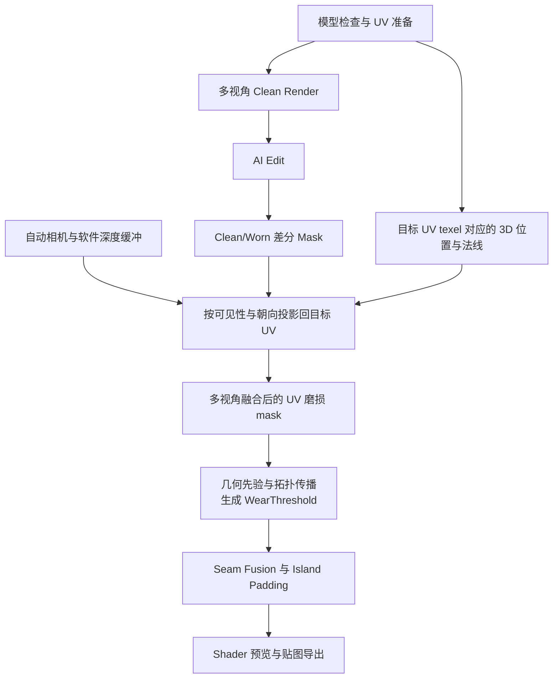

【效果展示 Wear Amount 30/60/100】

# 快速上手
<font style="color:rgb(51, 51, 51);">要求 Blender 3.6+；运行期只使用 Blender 自带的 </font>`<font style="color:rgb(0, 0, 0);background-color:rgb(240, 240, 240);">bpy</font>`<font style="color:rgb(51, 51, 51);">和 Python 标准库，不需要额外环境依赖。插件支持配置自定义api端点和key以访问OpenAI、Gemini等模型、或者本地/云端部署的ComfyUI进行生图</font>

1. 正确安装插件（从zip安装）
2. <font style="color:rgb(51, 51, 51);">在 </font>`<font style="color:rgb(0, 0, 0);background-color:rgb(240, 240, 240);">Edit > Preferences > Add-ons > AI Wear Texture</font>`<font style="color:rgb(51, 51, 51);"> 中配置 Provider</font>
3. <font style="color:rgb(51, 51, 51);">选中目标 Mesh，打开 </font>`<font style="color:rgb(0, 0, 0);background-color:rgb(240, 240, 240);">N > AI Wear</font>`
4. <font style="color:rgb(51, 51, 51);">配置 UV Mode、相机、Prompt 和 WearTime 参数</font>
5. <font style="color:rgb(51, 51, 51);">先运行 Preflight，再点击 </font>`<font style="color:rgb(0, 0, 0);background-color:rgb(240, 240, 240);">Generate Wear Texture</font>`
6. <font style="color:rgb(51, 51, 51);">完整运行管线后，插件将自动将磨损效果与当前shader的base color接线混合，直接拖动 </font>`<font style="color:rgb(0, 0, 0);background-color:rgb(240, 240, 240);">Wear Amount</font>`<font style="color:rgb(51, 51, 51);"> / </font>`<font style="color:rgb(0, 0, 0);background-color:rgb(240, 240, 240);">Feather</font>`<font style="color:rgb(51, 51, 51);">即可观察到效果</font>
7. <font style="color:rgb(51, 51, 51);">只修改几何先验、拓扑、seam 或生长参数时，支持用 </font>`<font style="color:rgb(0, 0, 0);background-color:rgb(240, 240, 240);">Replay Downstream</font>`<font style="color:rgb(51, 51, 51);"> 复用上次 AI 生图结果</font>

# Promblem Reframing
参考技术路线试图从AI生成的带透视的磨损效果参考直接映射回模型UV，但是从单张未知参考图反推到模型UV本身就是**欠定**问题。相机参数未知、遮挡不可见、同类几何重复、透视与表面展开不同构，无法保证2d像素与3d表面点一一对应，而直接“把参考图铺平到 UV”只能在少数受控案例中成立，如果模型资产本身**不作为**ai的输入，那么**生成磨损mask**和**uv映射/展开**这两个步骤本身就不适合交给ai来做

所以这里调整的AI在整个任务中的角色，让AI更多的负责磨损效果的生成，用来确定磨损的形态，而UV的处理更多的交给程序化的处理。

整体管线如图：




# 工具设计
## 多视角AI生成
既然单张生成-映射是欠定问题，最直接能想到的替代方案就是多视角生成。但是多视角生成天然会碰到一致性的问题。这里提供的解决方案是使用支持多模态的图像生成模型，用历史视角生成结果充当下一视角生成的上下文条件：


+ Independent：每次独立生成，不考虑历史生成结果上下文，容易产生风格或视角上的不对齐
+ First-view Anchor：每次生成使用首次生成的历史视角的生成结果作为上下文输入
+ Previous View：每次生成使用前一次生成的历史结果作为上下文输入

工具基于mesh的包围盒，提供了多种不同的预设相机选项：

+ Turnable 4：水平4视角
+ Auto 6：使用四个水平环绕视角和顶部、底部视角
+ Auto 8：使用八个对称斜向视角
+ Counted Auto：Fibonacci sphere 生成指定数量的采样点


## 磨损Mask计算
在使用一些相对比较老的模型执行Image Editing的时候，通常会给原始图片引入整体曝光上的变化，即使人眼观察不出来，直接diff减法做mask还是会把这种变化判定为磨损。因此插件先让当前视角下AI生成的磨损效果各颜色通道均值与原始渲染图对齐，再取亮度差和最大通道差：

```latex
scale_c = mean(clean_c) / mean(worn_c)
worn_matched_c = clamp(worn_c · scale_c)

d_luma = |luma(worn_matched) - luma(clean)|
d_rgb  = max_c |worn_matched_c - clean_c|
M_i    = clamp(max(d_luma, d_rgb) / max(P95(d > 0.02), 0.05))
```


## UV质检与重展开
前一步生成的磨损是固定视角下的 view space 磨损效果，在合并并进行重投影之前需要进行uv准备，这里提供两种模式：

**Mode A：**直接选取已有 UV 作为 Target Wear UV。该模式适合 UV 已经通过生产检查的资产，如果UV本身存在重叠或镜像，该模式并不会让不同表面共享同一份磨损

**Mode B：**保留原 UV，另外建立（或复用）`AI_WearUV` 层并自动展开，让磨损贴图拥有独立且唯一的坐标。展开使用 Blender 的 Smart UV Project（默认 `angle_limit=66°`），再用 Pack Islands 收紧排布


插件同时提供UV质检，检查模型UV是否存在翻转、越界、重叠等退化情况，Mode B在自动展UV后将自动运行质检，若不通过将放宽参数迭代直到通过

## 磨损效果重投影
在准备好目标mesh的 UV 后，进入重投影阶段。插件先把每个 UV 三角形光栅化，在有效 texel 上保存 triangle id 和重心坐标。已知三角形顶点 `(V0,V1,V2)` ，可以直接恢复该 texel 的世界空间位置与法线：

```latex
P(u,v) = b0·V0 + b1·V1 + b2·V2
N(u,v) = normalize(b0·N0 + b1·N1 + b2·N2)
```

将 `P` 乘以相机逆世界矩阵并做透视投影，得到屏幕坐标和深度。插件同时把模型三角形光栅化成软件 Z-buffer；只有投影点位于画面内、没有被更近的表面遮挡，并且法线朝向相机时，这个视角的 mask 才能写入该 texel。此外考虑到掠射角下磨损容易形成错误投影，因此引入视角权重混合，可见性判断和视角权重在同一步完成：

```latex
visible_i = z <= Z_i(x,y) + depth_epsilon
facing_i  = clamp(dot(N, view_dir), 0, 1)^gamma
w_i       = visible_i · facing_i

F_ai = sum(w_i · M_i) / sum(w_i)
```

`gamma` 越大，正视角占据的权重越高，掠射角越容易被排除。多视角融合之后得到的 `F_ai` 是一张 UV atlas 中的 AI 观测场，但“同处一张图片”并不等于 UV 岛之间已经建立连续性约束。

## 磨损程度控制算法
经过重投影之后，我们已经可以得到模型各个位置处对应的磨损形态，但是目前我们尚且无法对磨损的程度进行精细的控制。磨损的强度不应该直接交给alpha来整体控制，而应该呈现出一种根据几何形态扩散蔓延的趋势，这仅凭一张形态贴图是无法做到的，因此还需要额外引入一张阈值图`WearThreshold`

这张阈值图先用几何把“哪里更可能磨损”整理成一个表示趋势的量 $ P $，再让磨损按倾向从高到低沿拓扑传播。$ F_{ai} $ 先按 UV 重心权重汇总到 mesh 顶点，得到 $ F_{ai}(v) $，再与三个几何项组合：

+ **凸度：**对每条恰好连接两个面的拓扑边，取两侧面法线夹角、用边中点相对面中心的符号判定凸/凹（凸棱为正、凹槽为负），按顶点取均值得到 $ C(v)\in[-1,1] $；
+ **视角暴露度** $ E(v) $ ：当前顶点被多少个自动相机看到的比例，作为“是否长期外露、可被接触”的廉价近似；
+ **凹陷惩罚：**即 $ \max(-C,0) $

这样凸棱、AI 判定的划痕和外露面倾向高，凹槽与内角被压低；但任一项权重过高都会压制其余信号，$ w_{cavity} $ 过大也会把图像里合理的局部磨损误压掉。

至此，我们得到的$ P $ 趋势场可以用来表示几何更容易受到磨损的区域，而为了决定磨损从哪里开始扩散，插件会从 $ P $ 的局部极大值中挑选种子，并让这些种子只沿真实 mesh edge graph 扩散_<u>（不能直接在 UV 上把 mask 向外扩散，UV 岛彼此分离，直接扩散会把原本相邻的表面排到很远的位置，只有沿真实 mesh edge graph 扩散才能让磨损从凸棱、高接触区等起点自然蔓延到相邻表面，并在跨 UV seam 时保持连续）</u>_开启材质边界阻挡后，磨损也会更难跨越不同材质的交界。

在知道磨损效果从哪里开始扩散后，使用多源 Dijkstra 为每个顶点计算它到最近种子的传播距离。离种子近的顶点会更早出现磨损，距离更远的顶点则需要更高的 `Wear Amount` 才会被激活。这个距离再与 $ P $ 和按三维位置采样的低频噪声混合，形成每个顶点的阈值 $ T(v) $。噪声在世界空间，不会因为 UV seam 被拆开。最终的 $ T(v) $ 会按 UV 光栅化时保存的三角形与重心坐标插值，烘焙回 `WearThreshold.png`。

最后引入$ \alpha $ 用于调节“沿拓扑扩散”和“直接根据局部倾向判断”两种效果的比例。$ \alpha $ 较大时，磨损更容易形成沿凸边和连通曲面延伸的带状区域；$ \alpha $ 较小时，结果更零碎，也更贴近 $ P $ 的局部变化。关闭拓扑生长时，不运行 Dijkstra，而是直接用 $ 1-P $ 与三维噪声生成阈值图。

无论是否开启拓扑传播，Shader 都只读取已经生成的 `WearThreshold`，实时显示时，`Wear Amount` 与阈值 $ T $ 先通过 smoothstep 计算出门控值 $ g $，再与 AI 差分结果中实际有磨损证据的 `WornTex.alpha` 相乘：

$ g=\operatorname{smoothstep}(T-\mathtt{feather},\ T+\mathtt{feather},\ \mathtt{wear\_amount}) $

$ \mathtt{final\_mask}=g\cdot\mathtt{WornTex.alpha} $

## UV接缝处理
之所以会产生UV接缝，是因为 UV 展开会把连续的模型表面切开，再把每一块表面分别摊到同一张二维纹理图的不同区域

之前做的多视角加权融合只保证多个相机投到同一个 UV texel 的 mask 值被平均，并不会让一条三维边在两个 UV 岛上的副本自动相等。而相邻面可能主要由不同相机覆盖，具有不同的遮挡、法线权重和高频图像采样；即使边界数值相同，mipmap等也可能读到 UV 岛外像素

这里把直接针对接缝的处理和padding两种处理明确分开：

+ Seam Fusion 直接针对接缝进行处理，遍历恰好连接两个面的拓扑边，如果同一端点在两个 face loop 上的 UV 不同，就登记为一条 UV seam；随后在相同的三维边参数 `t` 上采样两侧、**取最大**并写回
+ Island Padding 用于避免纹理过滤读到黑色、中性色或邻近小岛（不能让原本不同的两侧数据自动一致），从 UV 岛有效区域向外padding

对于重叠 UV、开口边、已经拆成不同顶点的几何或彼此不连通的部件，不存在可以自动找到的“两侧”，这类问题会直接被UV质检给挡掉

# 实验
## 相机数量对AI结果的影响


## 额外提示词对AI结果的影响


## <font style="color:rgb(0, 0, 0);">逐视角上下文是否改善一致性</font>


## 消融1：几何先验


## 消融2：拓扑传播


## 消融3：接缝处理


# Future Works


# 外部资产
[https://polyhaven.com/a/gaming_console](https://polyhaven.com/a/gaming_console)

[https://polyhaven.com/a/ceiling_fan](https://polyhaven.com/a/ceiling_fan)

